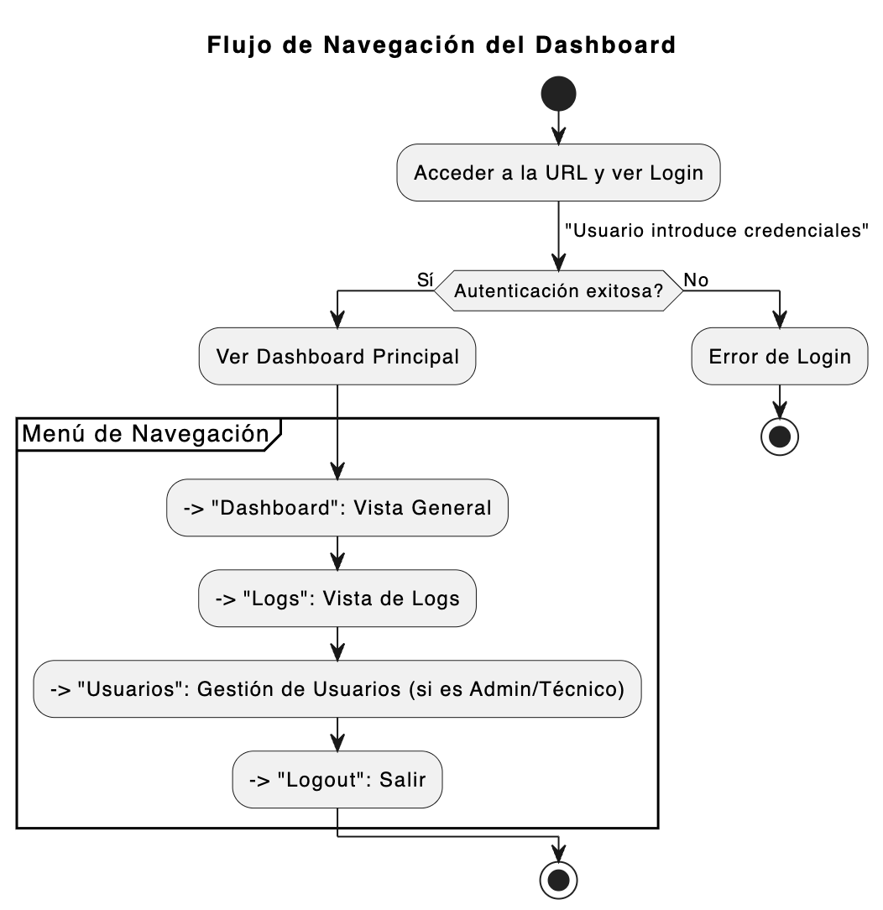
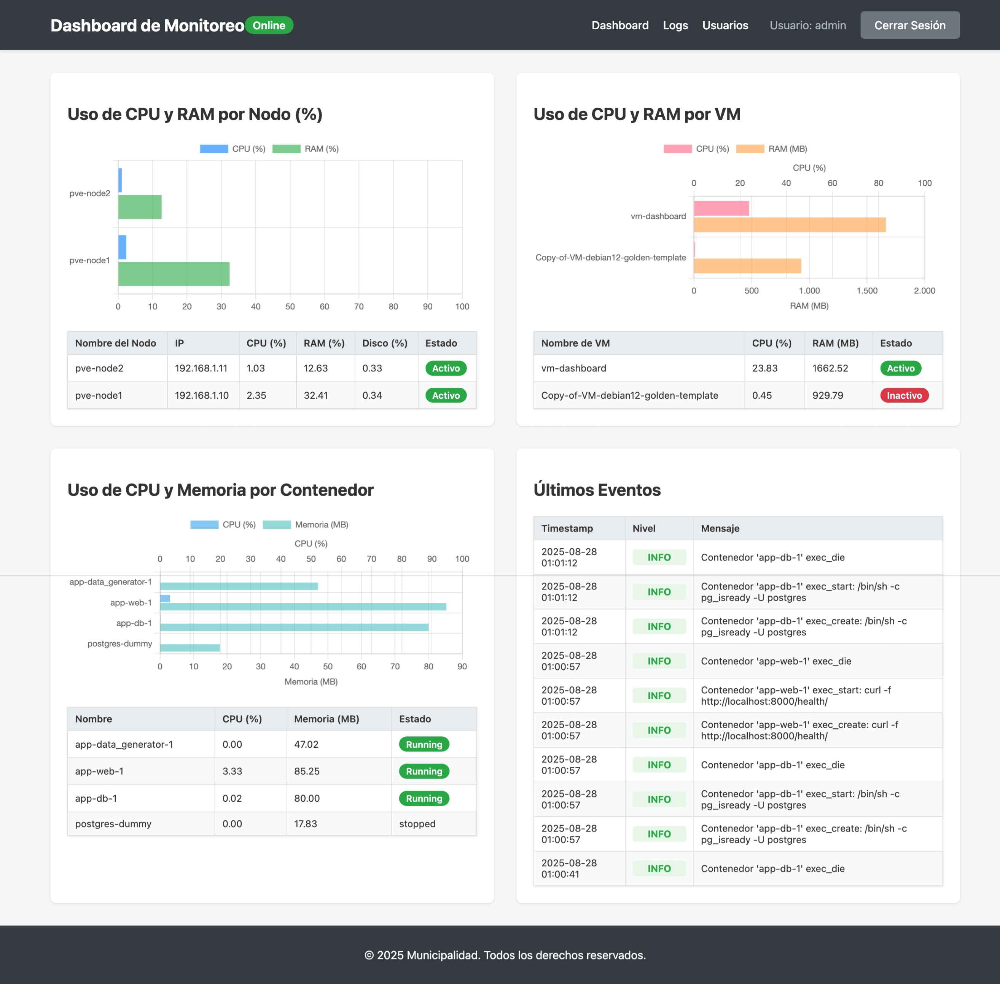
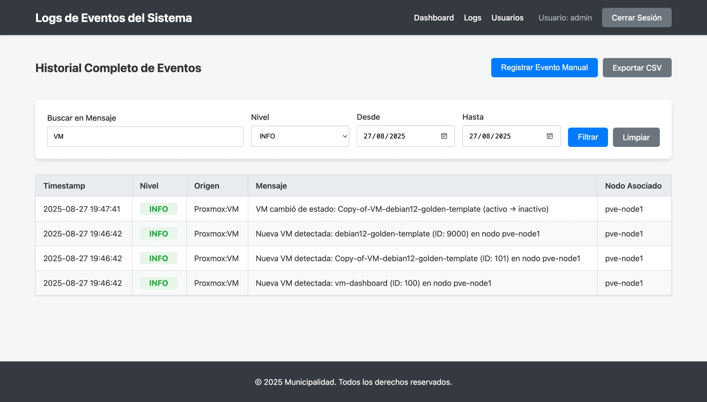
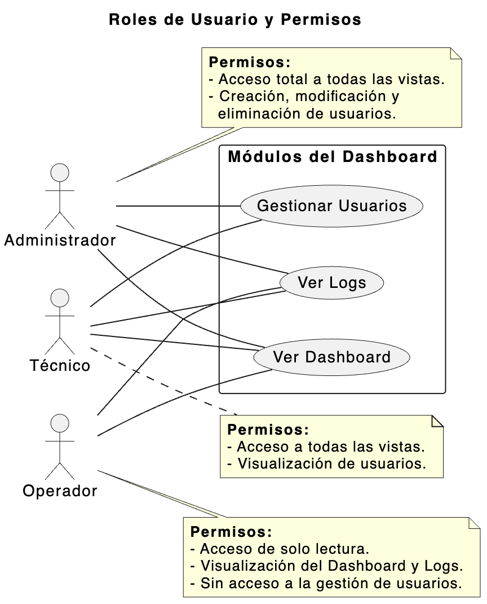
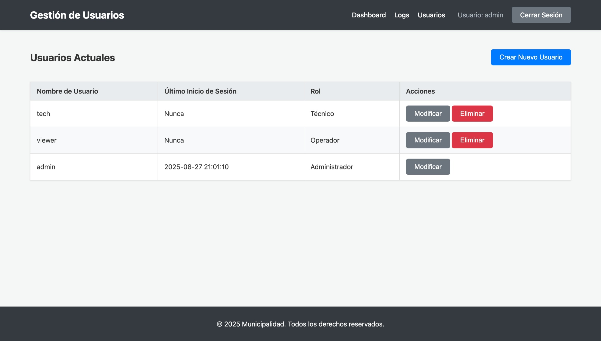
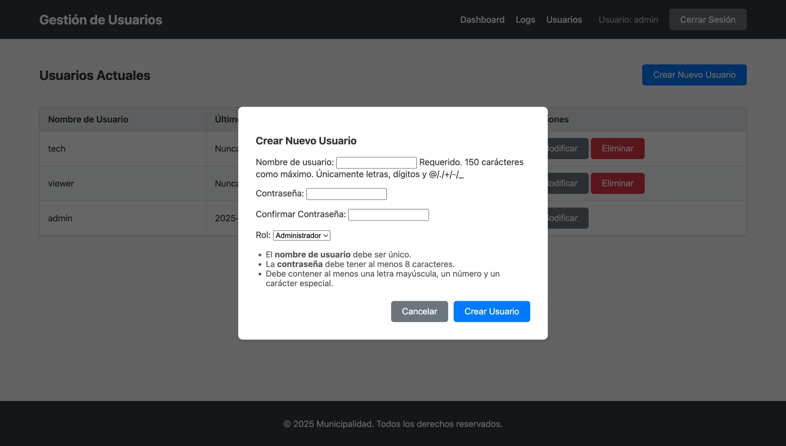
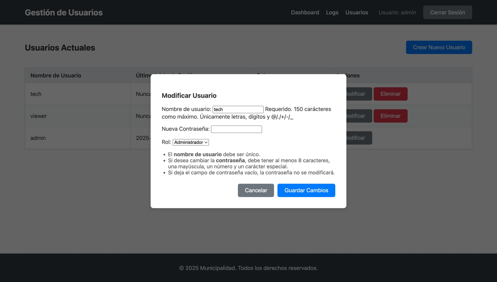

# Manual de Usuario: Dashboard de Monitoreo

**Versión 3.0**
**Fecha de Elaboración:** 27 de agosto de 2025

---

## 1. ¡Te damos la bienvenida!

¡Hola! Este manual es tu guía para navegar y aprovechar al máximo el **Dashboard de Monitoreo de Infraestructura**. Hemos diseñado esta herramienta pensando en ti, para que puedas entender de forma sencilla y visual qué está ocurriendo con nuestros sistemas tecnológicos en tiempo real.

No te preocupes si no tienes conocimientos técnicos; aquí te explicaremos todo paso a paso.

---

## 2. Guía de Primeros Pasos

Empezar a usar el dashboard es muy fácil. ¡Vamos a ver!

### 2.1. Cómo Iniciar Sesión

1.  **Abre la aplicación:** En tu navegador web, ve a la dirección que te proporcionaron (por ejemplo, `http://192.168.1.100`).
2.  **Ingresa tus credenciales:** Verás la pantalla de bienvenida. Escribe el **nombre de usuario** y la **contraseña** que te asignaron.
3.  **Accede:** Haz clic en el botón **"Iniciar Sesión"**.

> *Imagen: Formulario de inicio de sesión.*

### 2.2. Un Vistazo a la Interfaz Principal

Una vez dentro, te encontrarás con una interfaz limpia y organizada:

*   **Menú de Navegación (a la izquierda):** Es tu mapa para moverte por el sistema. Desde aquí puedes acceder a todas las secciones: `Dashboard`, `Logs` y `Usuarios`.
*   **Área de Contenido (a la derecha):** Aquí es donde ocurre la magia. Verás toda la información de la sección que hayas seleccionado en el menú.

---

## 3. Funcionalidades Clave: ¿Qué Puedes Hacer?

Aquí te describimos las herramientas principales que tienes a tu disposición.

### 3.1. Dashboard: Tu Centro de Mando

Esta es la primera pantalla que verás y te da un resumen completo del estado de la infraestructura de un solo vistazo.

> *Imagen: Dashboard con tarjetas de monitoreo.*

*   **¿Qué encontrarás?**
    *   **Tarjetas de Estado de Nodos:** Piensa en un "Nodo" como un ordenador o servidor principal. Estas tarjetas te dicen cómo se está comportando: cuánta **CPU (potencia), Memoria RAM y Disco (almacenamiento)** está usando. Las barras de colores te ayudan a identificar si todo va bien (verde) o si algo necesita atención (amarillo o rojo).
    *   **Tarjetas de VMs y Contenedores:** Son como "mini-ordenadores" y aplicaciones que corren dentro de los nodos. Estas tarjetas te muestran si los servicios que usa la aplicación están funcionando correctamente.
    *   **Tabla de Últimos Eventos:** Un pequeño resumen de las últimas 10 cosas que han pasado en el sistema, ya sean informativas o alertas.

### 3.2. Gestión de Logs: El Diario del Sistema

Esta sección es como el diario de a bordo de la infraestructura. Registra absolutamente todo lo que sucede. Es muy útil para investigar problemas o entender qué ocurrió en un momento determinado.

> *Imagen: Tabla de logs con filtros y paginación.*

*   **Instrucciones paso a paso:**
    1.  **Accede a la sección:** Haz clic en **"Logs"** en el menú.
    2.  **Explora los registros:** Verás una tabla con todos los eventos, del más reciente al más antiguo.
    3.  **Usa los filtros para encontrar algo específico:**
        *   **Buscar por Mensaje:** Escribe una palabra en la caja de búsqueda (ej. "error", "usuario conectado").
        *   **Filtrar por Nivel:** Despliega la lista para ver solo los eventos de un tipo (`INFO`, `WARNING`, `ERROR`).
        *   **Filtrar por Fecha:** Usa los calendarios para ver qué pasó en un día o un rango de días concreto.
    4.  **Resultado esperado:** La tabla se actualizará al instante, mostrándote solo los registros que cumplen tus criterios.

*   **Funcionalidades Adicionales:**
    *   **Crear Evento Manual:** Si realizas una acción importante (como un mantenimiento), puedes dejar constancia. Haz clic en **"Crear Evento Manual"**, rellena el formulario y tu anotación quedará guardada en el historial.
    > 
    > *Imagen: Formulario para la creación de un log manual.*
    *   **Exportar a CSV:** ¿Necesitas los datos para un informe? Aplica los filtros que quieras y haz clic en **"Exportar a CSV"** para descargar una hoja de cálculo con esa información.

### 3.3. Gestión de Usuarios: ¿Quién Accede?

Esta sección (visible solo para **Administradores** y **Técnicos**) permite gestionar las cuentas de las personas que usan este dashboard.

#### Roles de Usuario y Permisos

El acceso a las funcionalidades del dashboard depende del rol asignado a cada usuario. El siguiente diagrama resume los permisos:

*Diagrama: Relación entre roles de usuario y acceso a módulos del sistema.*

> *Imagen: Lista de usuarios y formularios de gestión.*

*   **Instrucciones paso a paso (para Administradores):**
    1.  **Crear un usuario:** Rellena el formulario "Crear Nuevo Usuario" con sus datos y asígnale un rol. El usuario podrá acceder inmediatamente.
    > 
    > *Imagen: Formulario para añadir un nuevo usuario.*
    2.  **Modificar un usuario:** Haz clic en "Modificar" junto a un usuario de la lista para cambiar su rol o sus datos.
    > 
    > *Imagen: Formulario para editar un usuario existente.*
    3.  **Eliminar un usuario:** Haz clic en "Eliminar" para dar de baja una cuenta. El sistema te pedirá confirmación.

---

## 4. Preguntas Frecuentes (FAQ)

Aquí respondemos a algunas de las dudas más habituales.

*   **P: He olvidado mi contraseña, ¿cómo la recupero?**
    *   **R:** Por motivos de seguridad, no hay una opción de recuperación automática. Debes contactar a un **Administrador** del sistema para que te asigne una nueva contraseña.

*   **P: La información en el dashboard no parece cambiar o está "congelada". ¿Qué hago?**
    *   **R:** Lo primero, prueba a refrescar la página en tu navegador (normalmente con la tecla F5 o el botón de recargar). Si el problema continúa, podría haber un retraso en la llegada de datos. Si persiste por mucho tiempo, informa a tu **soporte técnico**.

*   **P: ¿Por qué no veo la sección "Usuarios" en mi menú?**
    *   **R:** El acceso a esa sección está limitado a los roles de **Administrador** y **Técnico**. Si tu rol es "Operador", no la verás porque tu función es de visualización.

*   **P: ¿Cómo puedo contactar con el soporte técnico?**
    *   **R:** Si encuentras un problema que no puedes resolver, por favor, contacta con el departamento de TI a través de [indicar aquí el email o método de contacto oficial].

---

## 5. Glosario: Pequeño Diccionario Técnico

No te asustes con estos términos, ¡aquí te los explicamos!

*   **CSV:** Un tipo de archivo de hoja de cálculo (como Excel), muy simple y compatible con muchos programas.
*   **Contenedor (Docker):** Imagina una caja pequeña y ligera que contiene una aplicación y todo lo que necesita para funcionar. Es una forma eficiente de ejecutar programas.
*   **CPU:** Es el "cerebro" del servidor. Un uso alto de CPU significa que está trabajando mucho.
*   **Dashboard:** Es la pantalla principal o "panel de control" que te da una visión general de todo.
*   **Log:** Un registro o anotación de un evento que ha ocurrido en el sistema.
*   **Nodo:** Un servidor o computador físico principal. Es parte de la base de nuestra infraestructura.
*   **RAM (Memoria):** Es la memoria a corto plazo del servidor. La usa para las tareas que está realizando en este momento.
*   **VM (Máquina Virtual):** Es como un "ordenador dentro de otro ordenador". Nos permite tener varios sistemas operativos funcionando en un solo servidor físico.
